# Arquitetura e Organização da Base de Dados — GV-CPS

Este documento descreve detalhadamente a organização física, lógica e de segurança da base de dados do **Global View B2B Marketplace (GV-CPS)** desenvolvida sobre o **Supabase (PostgreSQL)**.

---

## 1. Modelo de Dados e Relacionamentos

A base de dados foi desenhada seguindo o princípio da **separação de privilégios**. Dados de contacto privado (e-mails pessoais, números de telefone) estão isolados das listagens públicas para assegurar a regra de ouro de intermediação da plataforma (toda a negociação e contacto direto passam exclusivamente pela mediação da GV-CPS).

```mermaid
erDiagram
    profiles ||--|| profile_contacts : "contém (privado)"
    profiles ||--o{ requirements : "publica"
    profiles ||--o{ offers : "publica"
    profiles ||--o{ chat_rooms : "participa"
    
    requirements ||--|| requirement_contacts : "contém (privado)"
    offers ||--|| offer_contacts : "contém (privado)"
    
    requirements ||--o{ negotiations : "origina"
    offers ||--o{ negotiations : "origina"
    
    negotiations ||--o{ chat_rooms : "cria salas"
    chat_rooms ||--o{ chat_messages : "contém"
    negotiations ||--o{ internal_notes : "registra logs"
```



### Dicionário de Tabelas Principais

1. **`profiles`**
   * *Função*: Armazena dados de identificação pública das empresas e o papel do utilizador.
   * *Campos Chave*: `id` (UUID mapeado a partir de `auth.users`), `company_name`, `country`, `role` (`buyer`, `supplier`, `consultant`, `admin`).
2. **`profile_contacts`**
   * *Função*: Informações pessoais e de contacto direto do representante da empresa.
   * *Relação*: `1:1` com `profiles`. **Acesso restrito via RLS.**
   * *Campos Chave*: `real_name`, `email`, `whatsapp_phone`.
3. **`requirements`**
   * *Função*: Necessidades de compra publicadas no mural pelos compradores.
   * *Campos Chave*: `buyer_id` (FK para `profiles`), `title`, `description`, `quantity`, `logistics_included` (flag crítica de inclusão de logística).
4. **`offers`**
   * *Função*: Propostas/ofertas publicadas no mural pelos fornecedores.
   * *Campos Chave*: `supplier_id` (FK para `profiles`), `title`, `description`, `quantity`, `logistics_included`.
5. **`negotiations`**
   * *Função*: Liga um requisito a uma oferta, sob a supervisão de um consultor da GV-CPS.
   * *Campos Chave*: `requirement_id`, `offer_id`, `consultant_id`, `status` (`pending`, `negotiating`, `completed`, `cancelled`).
6. **`chat_rooms`**
   * *Função*: Salas de negociação privadas. Criam-se canais separados (Comprador ↔ Consultor e Fornecedor ↔ Consultor) para garantir que as partes nunca falem diretamente sem mediação.
7. **`chat_messages`**
   * *Função*: Mensagens enviadas dentro das salas de chat intermediadas.

---

## 2. Mecanismos de Segurança e RLS (Row Level Security)

Para blindar os dados e impedir acessos indevidos por utilizadores ou agentes externos, todas as tabelas possuem **Row Level Security (RLS)** ativo.

### Como operam as políticas RLS:
* **Mural Público (`requirements` e `offers`)**: Qualquer visitante ou utilizador pode ler os cabeçalhos das necessidades e ofertas (`SELECT` livre). No entanto, apenas utilizadores autenticados correspondentes ao seu ID podem inserir ou atualizar os seus próprios dados.
* **Tabelas de Contacto (`profile_contacts`, `requirement_contacts`, `offer_contacts`)**: Apenas o **próprio proprietário** dos dados ou o **Administrador** da plataforma conseguem ler estes registos. Nem mesmo os Consultores conseguem obter e-mails/WhatsApp pessoais de contactos diretamente da base de dados sem privilégios de Admin.
* **Negociações e Chats (`negotiations`, `chat_rooms`, `chat_messages`)**: Apenas os participantes atribuídos (o Comprador/Fornecedor correspondente, o Consultor mediador daquela sala ou o Administrador) podem ler ou enviar mensagens.

---

## 3. Segurança a Nível de Servidor (Database Triggers)

A base de dados possui inteligência ativa que corre de forma autónoma diretamente no PostgreSQL:

### A. Filtro Automático Anti-Contacto
Um trigger corre imediatamente **antes de qualquer inserção ou atualização** nas tabelas de descrições livres (`requirements`, `offers`) e mensagens de chat (`chat_messages`).
* **Expressão Regular utilizada**: 
  `([a-zA-Z0-9._%+-]+@[a-zA-Z0-9.-]+\.[a-zA-Z]{2,})|(\+?[0-9\-\s\(\)]{8,20})|(https?:\/\/[^\s]+)|(www\.[^\s]+)`
* **Ação**: Se for detetado um e-mail, número de telefone com mais de 8 dígitos ou URL/Link de um site, a base de dados **cancela a transação** e devolve um erro descritivo ao frontend. Isto evita bypasses caso o utilizador tente contornar o frontend.

### B. Auto-Sincronização no Registo (Auth Sync)
Quando um novo utilizador é registado via Supabase Auth, o trigger `on_auth_user_created` encarrega-se de instanciar automaticamente:
1. Um perfil público correspondente na tabela `public.profiles`.
2. Um registo de contacto associado na tabela `public.profile_contacts`.

---

## 4. Escalabilidade Futura e Portabilidade (Exit Strategy)

O design SQL e a organização de chaves estrangeiras foram construídos para permitir que a plataforma migre para fora da nuvem Supabase quando necessário.

### Arquitetura de Migração Futura:
* **Banco de Dados**: PostgreSQL padrão. O script `supabase_schema.sql` utiliza funcionalidades compatíveis com qualquer PostgreSQL local ou em VPS (Docker).
* **Autenticação**: Se a plataforma deixar de usar o Supabase Auth (migrando para Keycloak ou Auth0), basta remover o trigger `on_auth_user_created` e fazer com que o backend de API (ex: NestJS) controle a escrita de novos perfis na base de dados durante o fluxo de registo.
* **Tempo Real (WebSockets)**: As ligações em tempo real do chat utilizam WebSockets padrão (via Supabase Realtime). Caso se migre, o código do frontend apenas precisará de substituir o listener do Supabase por uma ligação ao socket da sua própria API (ex: Socket.io).

---

## 5. Tabela de Catálogo Interno de Produtos (`catalog_products`)

Adicionada em **13 de Agosto de 2026** para persistir o catálogo curado de produtos intermediados pela GV-CPS.

### Estrutura

| Campo | Tipo | Descrição |
| :--- | :--- | :--- |
| `id` | uuid | Chave primária gerada automaticamente |
| `sector` | text | Setor canónico: `chemicals`, `agro`, `oil`, `tech`, `logistics` |
| `category` | text | Subcategoria (ex: `acidos`, `sais`, `reagentes`, `consumiveis`) |
| `name_pt` | text | Nome do produto em Português |
| `name_en` | text | Nome do produto em Inglês |
| `pack_unit` | text | Embalagem/unidade (ex: `250g`, `2.5L`, `100 units`) |
| `quantity` | integer | Quantidade disponível/procurada |
| `price_usd` | numeric | Preço indicativo em USD (null se não definido) |
| `price_notes` | text | Notas sobre preço (ex: `Sob consulta`, `R$ 8.000,00`) |
| `brand` | text | Marca do produto (ex: `Merck`) |
| `origin` | text | País de origem ou disponibilidade |
| `notes` | text | Notas técnicas adicionais |
| `is_active` | boolean | Controlo de visibilidade no mural |
| `created_at` | timestamptz | Data de criação (UTC) |

### Políticas RLS

* **Leitura pública**: Qualquer visitante pode consultar o catálogo (`is_active = true`).
* **Escrita restrita**: Apenas Administradores podem inserir, atualizar ou remover produtos.

### Setor `chemicals` — Indústria & Reagentes Químicos

Primeiro setor alimentado via script `catalog_seed.sql`. Contém **33 produtos únicos** (36 da fonte, com 3 duplicados consolidados) da lista da *Mozambique Leaf Tobacco* (Marca: Merck), organizados em 4 subcategorias:

| Subcategoria | Chave | Nº Produtos |
| :--- | :--- | :---: |
| Ácidos & Solventes | `acidos` | 5 |
| Sais & Compostos Inorgânicos | `sais` | 12 |
| Reagentes Analíticos | `reagentes` | 11 |
| Consumíveis de Laboratório | `consumiveis` | 5 |

### Como executar o seed

```sql
-- 1. Aplicar o esquema (se ainda não aplicado):
--    Copiar conteúdo de supabase_schema.sql → Supabase SQL Editor → Run

-- 2. Popular o catálogo de produtos químicos:
--    Copiar conteúdo de catalog_seed.sql → Supabase SQL Editor → Run
```

